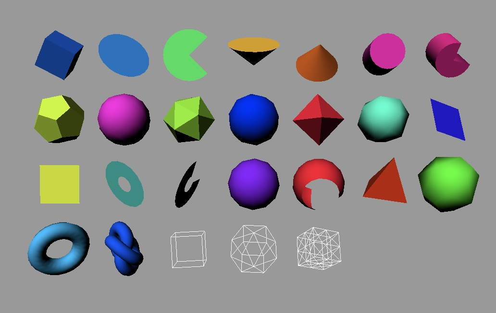

# three.js starter and sample using webpack5

## Install
    npm install

## Start Server
    npm start

## Build
    npm run build

## Write your own code
- copy the `src/hello_cube.js`
- modify the example code to replace the objects and animations
- add `src/hello_cube.js` to the `webpack.config.js`
  ```js
  entry: {
      my_script: './src/my_script.js'
  },
  new HtmlWebpackPlugin({
      title: 'three.js my_script',
      filename: 'my_script.html',
      chunks: ['my_script']
    })
  ```
- strat server `npm start`
- open the page `http:127.0.0.1:8080/my_script.html`

## Primitive Samples
